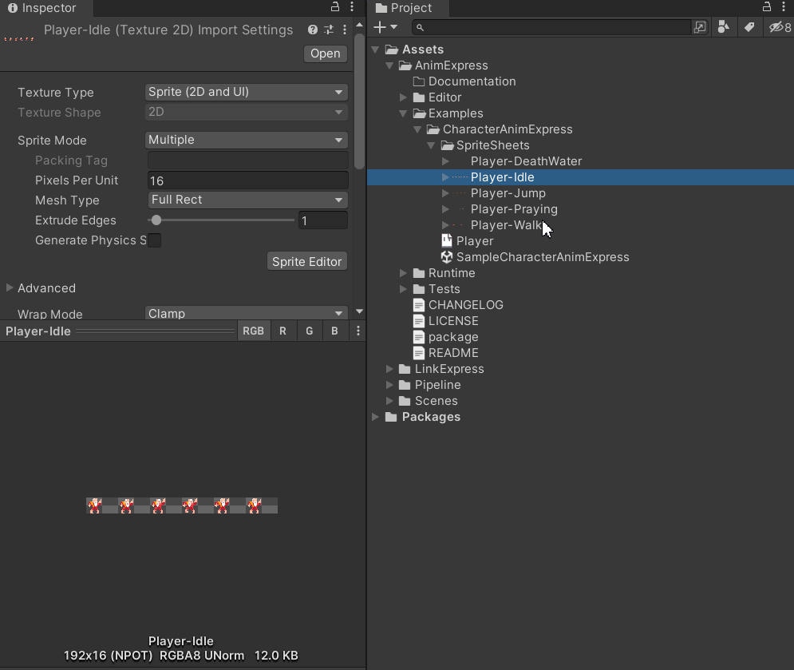
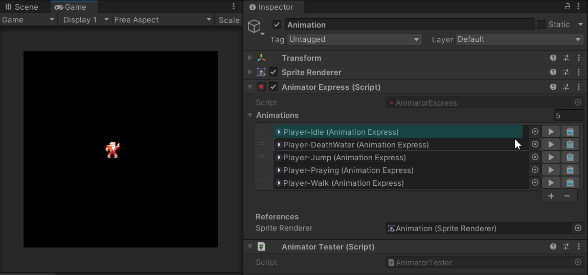

<div align="center">

# Anim-Express

[](https://unity3d.com/get-unity/download)
[](https://github.com/sgaumin/AnimExpress/blob/main/LICENSE.md)
[](https://twitter.com/Seb_gamedev)

**Lightweight Unity Utility to quickly setup 2D animations**
</div>

## Installation
You can install this library by the steps below.

1. Select **Window > Package Manager** from the menu bar.
2. Click the **+** button in the upper left corner of the window and select **Add package from git URL...**.
3. Enter the following URL in the input field and click **Add**.

```
https://github.com/sgaumin/AnimExpress.git
```

## Setup

### Animation Asset
After importing texture in the project, we can use utility method to generate animation assets. 
<p align="center">
  
</p>

### Animator Component
<p align="center">
  
</p>

## Features

### Play Animation
```csharp
animator = GetComponent<AnimatorExpress>();
animator.Play("AnimationName");
```

### Stop Animation
```csharp
animator = GetComponent<AnimatorExpress>();
animator.Stop();
```

### Event Subscription
```csharp
private AnimatorExpress animator;

private void Awake()
{
  animator = GetComponent<AnimatorExpress>();

  animator.AddListener("FrameName_0", CallBack1);
  animator.AddListener("FrameName_1", CallBack2);
}

private void OnDestroy()
{
  animator.RemoveListener("FrameName_0", CallBack1);
  animator.RemoveListener("FrameName_1", CallBack2);
}
```

## Support

If you ever come across any issues please feel free to report to the [Issues](https://github.com/sgaumin/AnimExpress/issues) page on this repository. All feedback is appreciated, and will be
taken on board for any future updates. 

## License

[MIT License](https://github.com/sgaumin/AnimExpress/blob/main/LICENSE.md)
